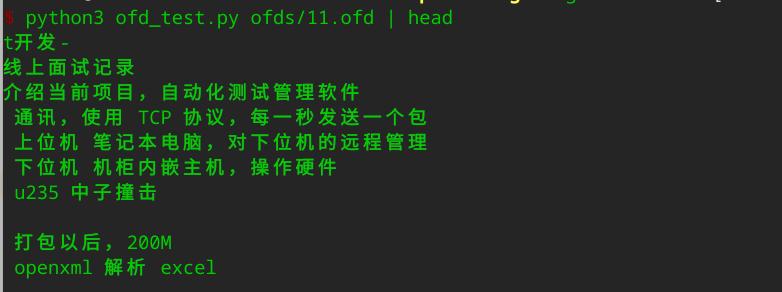

# ofd2txt

## 使用截图



## Usage

命令行调用
```bash
python3 ofd_test.py 1.ofd
```

代码中引用
```python
from ofdtotext import OFDFile


doc = OFDFile('test.ofd')
print(doc.get_text())
```


# ref
核心代码参考自 [ofd2img](https://github.com/geniusnut/ofd2img)

## 程序思路

先通过 **ofd2img** 项目中的代码解压 ofd(该文件类似于 docx 是一个zip压缩包) 文件
将 xml 通过[在线网站](https://www.freeformatter.com/xml-to-json-converter.html#ad-output)转为 json 格式，可清晰看出文本消息所处的层级关系，依次定义如下数据结构，即可提取所有文字

```python
class TextCode:
    def __init__(self, text_code):
        self.text = text_code.text


class TextObject:
    def __init__(self, text_obj):
        self.text_code = [TextCode(i['TextCode']) for i in text_obj.children]


class Layer:
    def __init__(self, layer):
        self.text_obj = layer['TextObject']


class Content:
    def __init__(self, content):
        self.layer = TextObject(content['Layer'])
```
